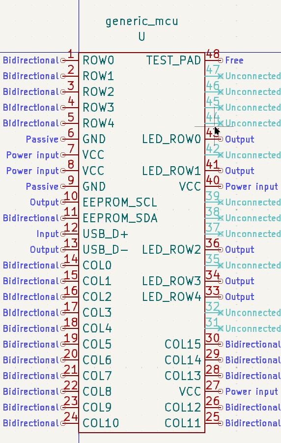
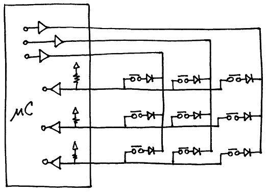
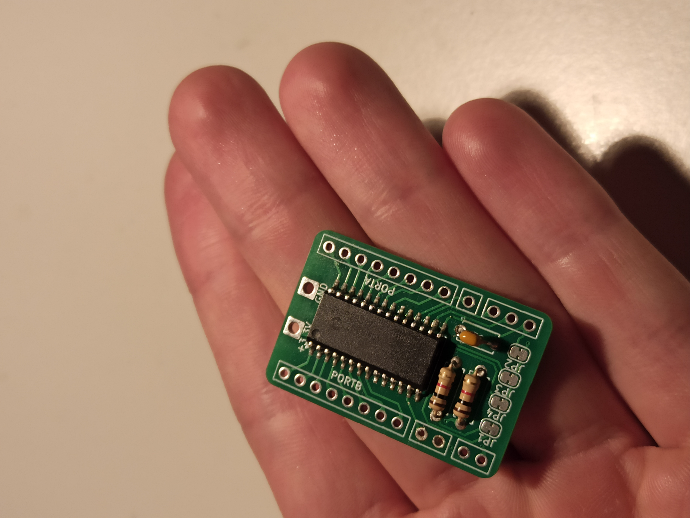
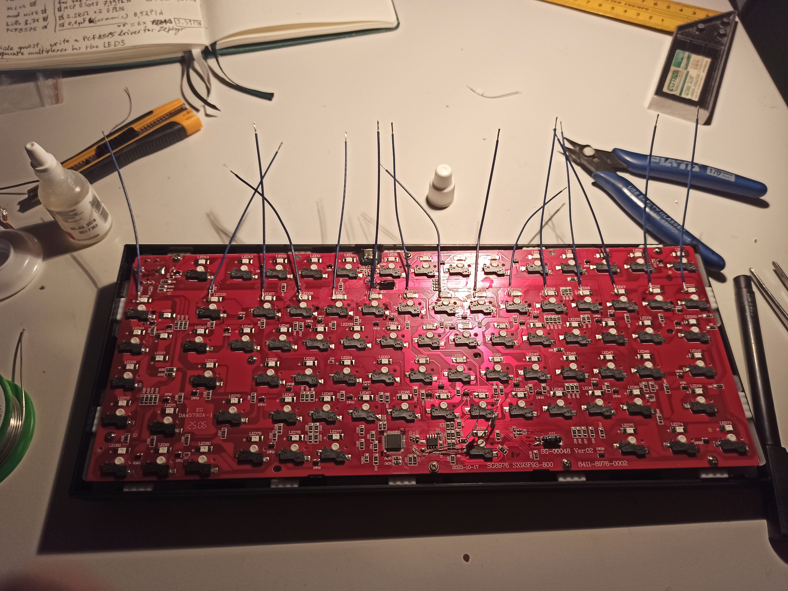
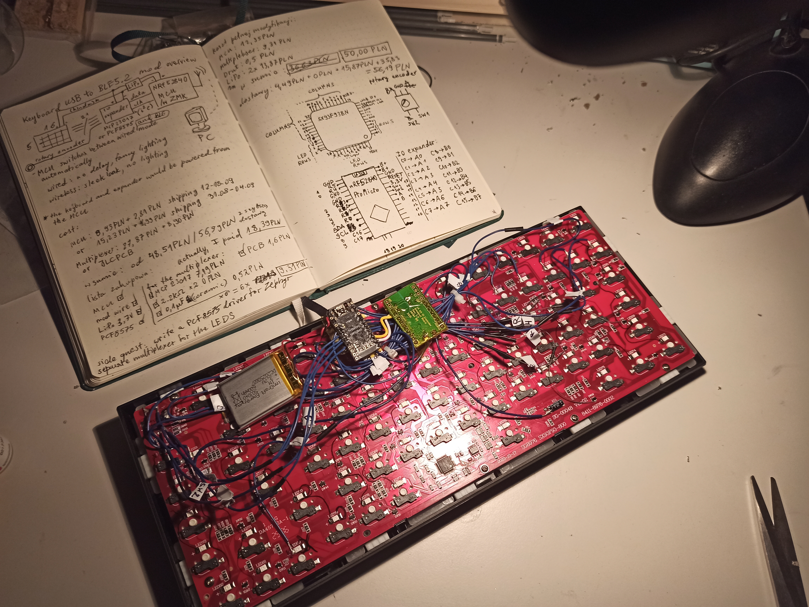

# AJAZZ AK820 Wireless Mod Devlog
A while ago, I wanted a wireless mechanical keyboard. So jumped on AliExpress and found one that I liked, but it also had an unnecessary OLED screen and RGB lighting which I'm not a fan of, which drove the price through the roof. Thankfully they had another version without all those things. There was a catch however - it was wired. I bought it anyways, but after a few months i started thinking about making it wireless again.

(WIP)

## Chapter 1 - the plan
My first thought was to hijack the USB data lines from the built-in microcontroller and insert my own tiny one (like a XIAO-seed or something), which I could've programmed to translate the USB frames into BLE frames. I'm sure that would work, but after a bit of thought i realised that would introduce unnecessary delay, routing the data through two physical stacks. That could potentially be fine - but I wanted to be sure that the work I'll put into it would pay off, so I instead opted for another solution.

I thought It'd be a lot better to just replace the old MCU with my own one and have it do absolutely everything. The plan was to essentially perform a brain transplant on a patient and slowly teach him to function again.

Writing the software by from scratch by myself sounds tempting, but I actually want to use the keyboard everyday so I focused on making it as reliable as possible. Luckily there's already a framework called ZMK, that's designed specifically for wireless, does exactly what I needed, uses tiny amounts of power and is easy to modify or extend.           
https://zmk.dev/docs

Finally, I needed to decide on the microcontroller. I checked ZMK's list of supported boards and found one that sounded promising. The Pro Micro nRF52840 has a built-in BLE transciever, has great support from the Zephyr OS, and uses tiny amounts of power. The only downside was that it wouldn't have enough pins to control all of the keyboards functionality.

## Chapter 2 - reverse engineering
In order to do this mod I needed to know everything about the original device. So I opened the case up, and immediately found the main ICs name - **SX93F93BN**. I hopped onto the internet to find out everything I could about this factory microcontroller. There was no datasheet online, just other people in forums, trying to identify it. After a bit of digging, I found this pinout on Reddit from **u/a_monide**:

Armed with this knowledge, I hopped back to the board with a multimeter and identified in which orientation it was. Then I verified that each pin had the function that the pinout had declared.

Turns out the keyboard was wired to use matrix polling. I checked the diode orientation — they were placed from rows to columns. This means the firmware drove each column low (to GND) in sequence and read the rows to detect which keys were pressed. The diode orientation ensures that current flows in only one direction, preventing ghosting and phantom key presses when multiple keys are pressed simultaneously.    
The schematic would look something like this:

The Ajazz AK820 also has a rotary encoder. I couldn't see any markings on it, but I took a wild guess that because it has 5 pins and a push button function, it might be similar to Alps EC11. Which is the most popular encoder for keyboards. After another hour with the multimeter and an oscilloscope I figured out how its pin layout worked and it matched!  

So at this point I knew exactly how each part works.

## Chapter 3 - a little side quest
Since the MCU that I chose wouldn't have enough pins, I needed to use some sort of IO expander. Instead of just buying one, I decided to have a little fun making my first PCB in KiCad. The schematic was very straightforward. For the IC, I chose the MCP23017 - my reasoning being that once again it's very well supported by Zephyr and ZMK. I also added in a spot for I2C pullup resistors and a few jumpers that would let me "configure" the breakout board in the future. For example, the **RESET** pin is always tied **HIGH** (because it's active low), but if I ever needed to use it in some application, its possible to cut the jumper and wire something to it.  
Finally, I ordered it from China, waited for the delivery and assembled it at home.

*Here's the final thing*

## Chapter 4 - the modification 

*Wiring the columns*

*Ready to put the lid back on*

## Chapter 5 - the firmware

